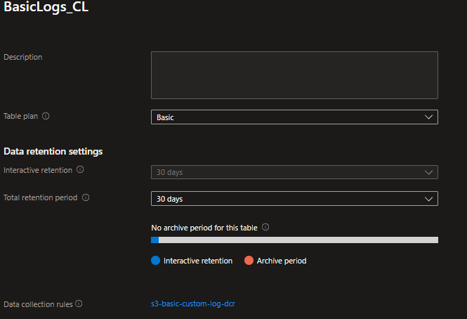

# Azure Monitor Container Logs

## IoT Edge

Our environment consists of a collection of IoT Hubs & Devices each with a number of docker containers.
We have a docker OMS Agent deployed on most of these devices.

## OMS Agent Migration to Azure Monitor

We are migrating to Azure Monitor and Some devices are already ARC connected hybrid linux machines.  

* We require an alternative method to `OMS-Agent` to collect docker container logs, container inventory and container metrics.
* It appears Container Insights is the recommended method, however from all our research Container Insights requires kubernetes. We do not want to deploy kubernetes.
* If it is do-able, we would like to use `Azure Monitor Agent` instead, to ingest the logs into a Log Analytics Workspace `Custom table`. The custom table to be in a `Basic Plan`.
* Azure Monitor Agent already ingest host metrics to the LAW Perf table.

### Create a data collection rule - Tests

The three methods to create a data collection rule with `Custom JSON Logs` all failed:

* Using Azure Portal
* Using ARM template
* Using Azure CLI

Detail of some of our attampts documented here.

[Tests & Results](TESTS.md)

[Example Docker logs file](tests/source-docker-log.json)

[Source Transformation Kusto query](tests/source-transform.kusto)

[Docker Daemon json](tests/docker-daemon.json)

## 1. Using Azure Portal


When we attempt to add `Custom JSON Logs` as an additional Data Source, this warning appears:

`'Custom JSON log' data source configuration is currently unavailable through the Portal as it is undergoing design updates to accommodate recent changes. For now, please use Azure CLI to configure 'Custom JSON log' in Data Collection Rules. Learn more.`


We used various ARM template formats found in Microsoft Documentation and suggested in other resources.

## 2. Using ARM templates

### Template Provided by a MS agent

[Template 1. tests/arm-template-1.json](tests/arm-1-template.json)

```shell
az deployment group create --resource-group "$RESOURCE_GROUP" --template-file "templates/arm-template-1.json"

```

Error:

`{"code": "InvalidRequestContent", "message": "The request content was invalid and could not be deserialized: 'Could not find member 'type' on object of type 'Template'. Path 'properties.template.type', line 2, position 11.'."}`

### Template 2. Using arm-2-template.json with parameter file. Provided MS Learn

[https://learn.microsoft.com/en-us/azure/azure-monitor/agents/data-collection-log-json#custom-table](https://learn.microsoft.com/en-us/azure/azure-monitor/agents/data-collection-log-json#custom-table)

[Template 2. tests/arm-2-template.json](tests/arm-2-template.json)

```shell
az deployment group create --resource-group "$RESOURCE_GROUP" --template-file "tests/arm-2-template.json" --parameters "tests/arm-2-params.json"

```

Error:

`{"status":"Failed","error":{"code":"DeploymentFailed","target":"/subscriptions/<SUBSCRIPTION_ID>/resourceGroups/<RESOURCE_GROUP>/providers/Microsoft.Resources/deployments/arm-2-template","message":"At least one resource deployment operation failed. Please list deployment operations for details. Please see https://aka.ms/arm-deployment-operations for usage details.","details":[{"code":"InvalidPayload","message":"Data collection rule is invalid","details":[{"code":"InvalidOutputTable","target":"properties.dataFlows[0]","message":"Table for output stream 'Custom-ContainerLogs' is not available for destination 'workspace'."},{"code":"InvalidOutputTable","target":"properties.dataFlows[0]","message":"Custom table for stream 'Custom-ContainerLogs' is not available for destination 'workspace'."}]}]}}`

## 3. Azure CLI

### Without using a rule file

```shell

az monitor data-collection rule create --location "$AZURE_REGION" --resource-group "$RESOURCE_GROUP" --name  "test-dcr"  --data-source customLogs --file-pattern "/var/lib/docker/containers/*/*.log" --record-delimiter "\n" --format json --workspace /subscriptions/$SUBSCRIPTION_ID/resourceGroups/$RESOURCE_GROUP/providers/Microsoft.OperationalInsights/workspaces/$WORKSPACE_NAME

```

Error:

`Failed to parse '--data-sources' argument: dict type value expected, got 'customLogs'(<class 'str'>)`

### With a rule file dcr-1

Rule file 1: [tests/dcr-1.json](tests/dcr-1.json)

```shell
az monitor data-collection rule create --location "$AZURE_REGION" --resource-group "$RESOURCE_GROUP" --name  "test-dcr" --rule-file "tests/dcr-1.json" --description "test-dcr"
```

Error:

`(InvalidPayload) Data collection rule is invalid
Code: InvalidPayload
Message: Data collection rule is invalid
Exception Details:      (InvalidDataFlow) 'DataFlows' destination name is unknown: {"name": "ContainerLog","type": "LogAnalytics", "workspaceResourceId": "/subscriptions/<SUBSCRIPTION_ID>/resourceGroups/<RESOURCE_GROUP>/providers/Microsoft.OperationalInsights/workspaces/<WORKSPACE_NAME>"}.
         Code: InvalidDataFlow
         Message: 'DataFlows' destination name is unknown: {"name": "ContainerLog","type": "LogAnalytics", "workspaceResourceId": "/subscriptions/<SUBSCRIPTION_ID>/resourceGroups/<RESOURCE_GROUP>/providers/Microsoft.OperationalInsights/workspaces/<WORKSPACE_NAME>"}.
`

### With a rule file dcr-2

Rule file 2: [tests/dcr-1.json](tests/dcr-1.json)

```shell

az monitor data-collection rule create --location "$AZURE_REGION" --resource-group "$RESOURCE_GROUP" --name  "test-dcr" --rule-file "tests/dcr-2.json" --description "test-dcr"

```

Error:

`
(InvalidPayload) Data collection rule is invalid
Code: InvalidPayload
Message: Data collection rule is invalid
Exception Details:      (InvalidDataFlow) 'DataFlows' destination name is unknown: {"name": "ContainerLog","type": "LogAnalytics", "workspaceResourceId": "/subscriptions/<SUBSCRIPTION_ID>/resourceGroups/<RESOURCE_GROUP>/providers/Microsoft.OperationalInsights/workspaces/<WORKSPACE_NAME>"}.
        Code: InvalidDataFlow
        Message: 'DataFlows' destination name is unknown: {"name": "ContainerLog","type": "LogAnalytics", "workspaceResourceId": "/subscriptions/<SUBSCRIPTION_ID>/resourceGroups/<RESOURCE_GROUP>/providers/Microsoft.OperationalInsights/workspaces/<WORKSPACE_NAME>"}.
        Target: Properties.DataFlows[0]
root@fe0ac91cc06d:/app/stage/az-logs# az monitor data-collection rule create --location "$AZURE_REGION" --resource-group "$RESOURCE_GROUP" --name  "test-dcr" --rule-file "tests/dcr-2.json" --description "test-dcr"
The command failed with an unexpected error. Here is the traceback:
Expect <class 'str'>, got {'name': 'logAnalytics', 'type': 'LogAnalytics', 'workspaceResourceId': '/subscriptions/<SUBSCRIPTION_ID>/resourceGroups/<RESOURCE_GROUP>/providers/Microsoft.OperationalInsights/workspaces/<WORKSPACE_NAME>'} (<class 'dict'>)
Traceback (most recent call last):
  File "/opt/az/lib/python3.11/site-packages/knack/cli.py", line 233, in invoke
    cmd_result = self.invocation.execute(args)
                 ^^^^^^^^^^^^^^^^^^^^^^^^^^^^^
  File "/opt/az/lib/python3.11/site-packages/azure/cli/core/commands/__init__.py", line 666, in execute
    raise ex
  File "/opt/az/lib/python3.11/site-packages/azure/cli/core/commands/__init__.py", line 733, in _run_jobs_serially
    results.append(self._run_job(expanded_arg, cmd_copy))
                   ^^^^^^^^^^^^^^^^^^^^^^^^^^^^^^^^^^^^^
  File "/opt/az/lib/python3.11/site-packages/azure/cli/core/commands/__init__.py", line 703, in _run_job
    result = cmd_copy(params)
             ^^^^^^^^^^^^^^^^
  File "/opt/az/lib/python3.11/site-packages/azure/cli/core/aaz/_command.py", line 155, in __call__
    return self._handler(*args, **kwargs)
           ^^^^^^^^^^^^^^^^^^^^^^^^^^^^^^
  File "/root/.azure/cliextensions/monitor-control-service/azext_amcs/aaz/latest/monitor/data_collection/rule/_create.py", line 33, in _handler
    self._execute_operations()
  File "/root/.azure/cliextensions/monitor-control-service/azext_amcs/aaz/latest/monitor/data_collection/rule/_create.py", line 815, in _execute_operations
    self.pre_operations()
  File "/root/.azure/cliextensions/monitor-control-service/azext_amcs/custom.py", line 112, in pre_operations
    setattr(args, arg_key, data[key])
  File "/opt/az/lib/python3.11/site-packages/azure/cli/core/aaz/_field_value.py", line 90, in __setattr__
    self[key] = data
    ~~~~^^^^^
  File "/opt/az/lib/python3.11/site-packages/azure/cli/core/aaz/_field_value.py", line 76, in __setitem__
    self._data[name] = attr_schema.process_data(data, key=name)
                       ^^^^^^^^^^^^^^^^^^^^^^^^^^^^^^^^^^^^^^^^
  File "/opt/az/lib/python3.11/site-packages/azure/cli/core/aaz/_field_type.py", line 409, in process_data
    value[idx] = sub_data
    ~~~~~^^^^^
  File "/opt/az/lib/python3.11/site-packages/azure/cli/core/aaz/_field_value.py", line 360, in __setitem__
    self._data[idx] = item_schema.process_data(data, key=idx)
                      ^^^^^^^^^^^^^^^^^^^^^^^^^^^^^^^^^^^^^^^
  File "/opt/az/lib/python3.11/site-packages/azure/cli/core/aaz/_field_type.py", line 234, in process_data
    value[key] = sub_data
    ~~~~~^^^^^
  File "/opt/az/lib/python3.11/site-packages/azure/cli/core/aaz/_field_value.py", line 76, in __setitem__
    self._data[name] = attr_schema.process_data(data, key=name)
                       ^^^^^^^^^^^^^^^^^^^^^^^^^^^^^^^^^^^^^^^^
  File "/opt/az/lib/python3.11/site-packages/azure/cli/core/aaz/_field_type.py", line 409, in process_data
    value[idx] = sub_data
    ~~~~~^^^^^
  File "/opt/az/lib/python3.11/site-packages/azure/cli/core/aaz/_field_value.py", line 360, in __setitem__
    self._data[idx] = item_schema.process_data(data, key=idx)
                      ^^^^^^^^^^^^^^^^^^^^^^^^^^^^^^^^^^^^^^^
  File "/opt/az/lib/python3.11/site-packages/azure/cli/core/aaz/_field_type.py", line 48, in process_data
    raise AAZInvalidValueError('Expect {}, got {} ({})'.format(self.DataType, data, type(data)))
azure.cli.core.aaz.exceptions.AAZInvalidValueError: Expect <class 'str'>, got {'name': 'logAnalytics', 'type': 'LogAnalytics', 'workspaceResourceId': '/subscriptions/<SUBSCRIPTION_ID>/resourceGroups/<RESOURCE_GROUP>/providers/Microsoft.OperationalInsights/workspaces/<WORKSPACE_NAME>'} (<class 'dict'>)
`

### Custom Basic Log Table

* A log analytics workspace with a `DCR-based` custom log table. Transformed from a docker log file, typically found in /var/lib/docker/containers/.



