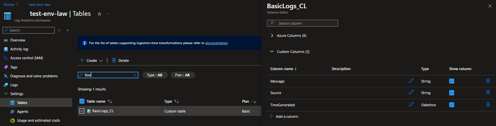
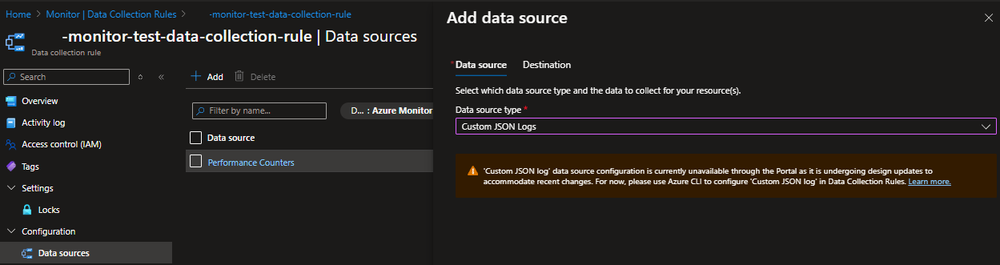

# az-logs

Our aim is to collect Docker `Custom json logs` from Ubuntu `IoT Edge devices` with a number of Docker containers.
Currently we achieve this with a `OMS-Agent` container.
We want to use `Otel Collector` instead, to ingest the logs into a Log Analytics Workspace `Custom table`. The custom table to be in a `Basic Plan`.

## Status

* A log analytics workspace with a `DCR-based` custom log table. Transformed from a docker log file, typically found in /var/lib/docker/containers/



## Creating a data collection rule with a Custom JSON Log

The three methods to create a data collection rule with `Custom JSON Logs`:

* Using Azure Portal
* Using ARM template
* Using Azure CLI  

### 1. Azure Portal

We were able to create a Data Collection Rule with Performance Counters. The `Azure Monitor Agent`, deployed on our IoT Edge devices,  are successfully ingesting the linux host metrics in the `Perf` table of the Log Analytics Workspace.


When we attempt to add `Custom JSON Logs` as an additional Data Source, this warning appears:

`'Custom JSON log' data source configuration is currently unavailable through the Portal as it is undergoing design updates to accommodate recent changes. For now, please use Azure CLI to configure 'Custom JSON log' in Data Collection Rules. Learn more.`



### 2. ARM template

Using this command:

```shell
az deployment group create --resource-group "$RESOURCE_GROUP" --template-file "arm-templates/template-1.json"

```

[ARM Template supplied by one of your agents.](arm-templates/template-1.json)

Error:

```shell
{"code": "InvalidRequestContent", "message": "The request content was invalid and could not be deserialized: 'Could not find member 'type' on object of type 'Template'. Path 'properties.template.type', line 2, position 11.'."}

```
